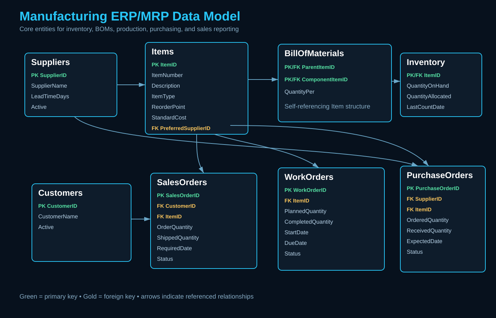
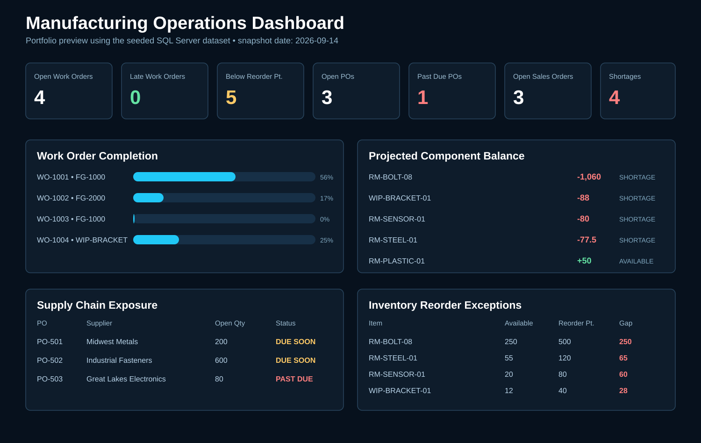

# Manufacturing ERP/MRP SQL Reporting System

A SQL Server portfolio project that simulates the reporting and operational support work of an IT Systems Analyst supporting a manufacturing ERP/MRP environment.

## Business scenario

A small manufacturer needs better visibility into production, inventory, purchasing, suppliers, and customer orders. The ERP contains the transactional data, but operations leaders need reusable SQL-backed reporting that quickly answers practical business questions.

This project models a simplified manufacturing system and demonstrates the lifecycle from business requirements through SQL design, reporting, testing, troubleshooting, data-integrity controls, user training, and support handoff.

## Architecture / ERD



The model covers suppliers and preferred sourcing, customers and sales orders, items and inventory, parent/component BOM relationships, production work orders, and purchase-order delivery exposure.

## What this project demonstrates

- Manufacturing ERP/MRP concepts: items, BOMs, inventory, work orders, purchase orders, sales orders, suppliers, and customers
- Business requirements translated into technical specifications and acceptance criteria
- SQL Server relational design with keys, constraints, indexes, views, and stored procedures
- BOM-driven material requirements, inventory shortages, production risk, supplier exposure, and fulfillment reporting
- Dashboard-ready datasets for Power BI, SSRS, or SSMS demonstrations
- Crystal Reports-style report requirements, parameters, grouping, and validation
- Functional, regression, reconciliation, and user-acceptance testing
- ERP troubleshooting and root-cause analysis
- Manufacturing data-integrity, traceability, access, and controlled-change concepts supporting quality-system objectives
- User training, implementation handoff, issue escalation, and post-launch follow-up

## Files

### SQL implementation
- `schema.sql` - tables, constraints, relationships, and reporting indexes
- `seed.sql` - realistic sample manufacturing data
- `reports.sql` - eight operational and management reporting queries
- `database_objects.sql` - reusable SQL views and stored procedures
- `dashboard_queries.sql` - dashboard-ready datasets

### Design and reporting
- `docs/erd.svg` - visual entity-relationship diagram
- `docs/dashboard-preview.svg` - portfolio dashboard preview
- `reports/crystal-report-specifications.md` - Crystal Reports-style designs for inventory, work orders, and supplier delivery
- `docs/requirements-and-technical-specification.md` - stakeholders, functional/non-functional requirements, acceptance criteria, traceability, and implementation approach

### Testing, quality, and support
- `docs/test-plan.md` - functional, regression, reconciliation, and user-acceptance test plan
- `docs/root-cause-case-study.md` - ERP/MRP troubleshooting case study from symptom through corrective action
- `docs/data-integrity-and-iatf-support.md` - manufacturing data-integrity and controlled-change practices that can support IATF 16949-related IT objectives
- `docs/user-training-and-handoff.md` - business-user training, IT support handoff, escalation, change communication, and post-launch validation

## Quick start

1. Create an empty SQL Server database named `ManufacturingERP`.
2. Run `schema.sql`.
3. Run `seed.sql`.
4. Run `database_objects.sql`.
5. Run `reports.sql` for the detailed reporting pack.
6. Run `dashboard_queries.sql` for dashboard-ready result sets.
7. Review the requirements, report specifications, test plan, root-cause case study, data-integrity controls, and user handoff artifacts as the implementation/support lifecycle.

The scripts are designed for Microsoft SQL Server / SQL Server Management Studio.

## Reusable database objects

### Views
- `dbo.vw_InventoryStatus` - available inventory, reorder status, and count-date visibility
- `dbo.vw_OpenWorkOrders` - production progress, remaining quantity, percent complete, and schedule risk
- `dbo.vw_MaterialShortages` - aggregated open-production demand versus available component inventory
- `dbo.vw_OpenPurchaseOrders` - supplier, open quantity, expected date, and delivery-risk status

### Stored procedures
- `dbo.usp_GetManufacturingKPIs` - management KPI card dataset
- `dbo.usp_GetWorkOrderRisk @DaysAhead` - configurable work-order schedule-risk report
- `dbo.usp_GetMaterialShortages` - projected shortage report ordered by severity

```sql
EXEC dbo.usp_GetManufacturingKPIs;
EXEC dbo.usp_GetWorkOrderRisk @DaysAhead = 3;
EXEC dbo.usp_GetMaterialShortages;
```

## Dashboard preview



The preview uses the sample data in `seed.sql` and demonstrates open work orders, reorder exceptions, material shortages, purchase-order exposure, sales-order status, and production completion.

## Requirements-to-support lifecycle

1. **Analyze the business need** - document stakeholders, requirements, priorities, and acceptance criteria.
2. **Design the solution** - map requirements to SQL objects, report specifications, and presentation datasets.
3. **Build** - implement controlled SQL schema/reporting objects.
4. **Test** - perform functional, integrity, regression, reconciliation, and user-acceptance testing.
5. **Implement** - release through an approved change process with validation and recovery planning.
6. **Train and hand off** - explain report interpretation, user actions, support information, and escalation paths.
7. **Support** - troubleshoot discrepancies using source-data reconciliation and root-cause analysis.
8. **Improve** - use recurring issues and business feedback to identify practical system enhancements.

## Manufacturing quality and data integrity

`docs/data-integrity-and-iatf-support.md` documents how referential integrity, standardized calculations, testing, traceability, access controls, controlled change, and evidence retention can support manufacturing quality-system objectives. It intentionally does not claim that this portfolio application is IATF 16949 certified or independently establishes compliance.

## Example interview walkthrough

1. Start with `docs/requirements-and-technical-specification.md` and explain how an operational problem becomes testable requirements.
2. Show the ERD and explain how Items connect production, purchasing, inventory, BOMs, and sales.
3. Run `dbo.usp_GetMaterialShortages` and `dbo.usp_GetWorkOrderRisk @DaysAhead = 3`.
4. Show the Crystal Reports specifications and dashboard preview.
5. Walk through the root-cause case study to demonstrate troubleshooting.
6. Show the test plan and explain controlled validation before release.
7. Explain the data-integrity/change-control artifact and its manufacturing quality-system context.
8. Finish with the user-training/support handoff guide to demonstrate implementation follow-through and communication with non-technical users.

## Portfolio talking points

This project demonstrates business-system support rather than only database coding. It shows the ability to gather and document requirements, understand manufacturing data relationships, translate operational needs into reusable SQL and report designs, investigate ERP issues, protect data integrity, validate system changes, support controlled implementation, train users, and communicate actionable information to Operations, Purchasing, Production, Supply Chain, Quality, management, and IT.

## Possible next enhancements

Future versions could add routing and work-center tables, lot/serial tracking, quality inspections, machine downtime, labor transactions, SQL Agent automation, a live Power BI report, and an AI support layer over approved ERP procedures and reporting data.
